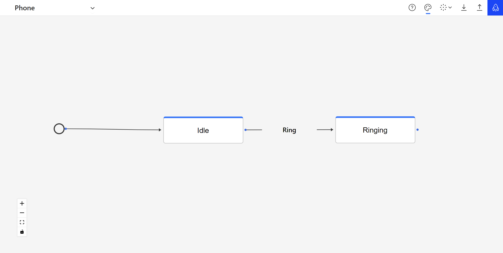
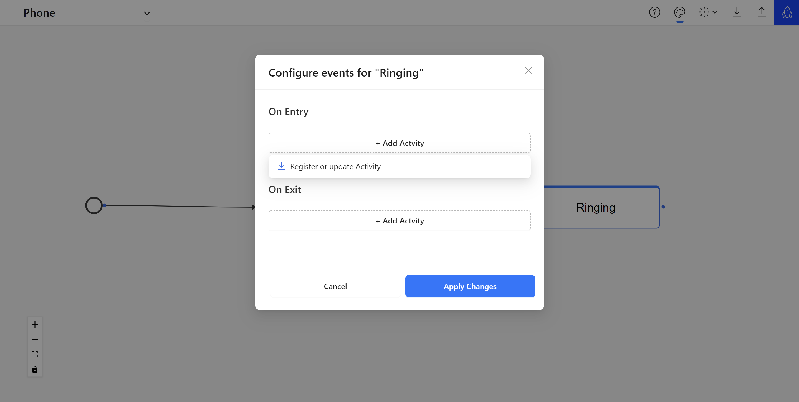

# FlowCiao

<div align="left">
    <br />
    
    <br />
    <br />
</div>

FlowCiao is a lightweight, user-friendly and extensible .NET state machine workflow that simplifies the creation and management of state machines in your applications. With FlowCiao, you can effortlessly define and control the flow of your application's logic. It will also contains a powerful server and a designer interface which will be explained later in the document.\
\
We prefer the term **"Flow"** instead of **"State Machine"**. Why "Flow"? because The term "Flow" captures the dynamic essence of the process. Like water flowing through paths, a Flow progresses through states guided by rules and conditions, making it a more intuitive term.

## Simplicity

Define your flow using an Easy-to-use and Fluent API

```csharp
builder
    .Initial(stepBuilder =>
    {
        stepBuilder
            .For(States.Idle)
            .Allow(States.Ringing, Triggers.Ring)
            .Allow(States.Busy, Triggers.Call)
    })
    .NewStep(stepBuilder =>
    {
        stepBuilder
            .For(States.Ringing)
            .Allow(States.Busy, Triggers.Pickup)
            .Allow(States.Idle, Triggers.Hangup)
    });
```

## Getting Started

To get started with FlowCiao, follow these steps:

1. Install FlowCiao via NuGet Package Manager.
2. Create your custom flow by implementing the `IFlowPlanner` interface.
3. Give it a unique `Key`
4. Define your States, Transitions, and Triggers using the fluent API provided by FlowCiao.
5. Start managing states and flows effortlessly in your application.

## Example

Here's a simple example of creating a flow for implementing a simple [Phone](https://github.com/Kingfish219/FlowCiao/tree/main/samples/FlowCiao.Samples.Phone/) machine with FlowCiao:

```csharp
public class PhoneFlow : IFlowPlanner
{
    public string Key { get; set; } = "phone";

    public IFlowBuilder Plan(IFlowBuilder builder)
    {
        builder
            .Initial(stepBuilder =>
            {
                stepBuilder
                    .For(States.Idle)
                    .Allow(States.Ringing, Triggers.Ring)
                    .Allow(States.Busy, Triggers.Call)
                    .OnEntry<PhoneOnEnterIdleActivity>()
                    .OnExit<PhoneOnExitIdleActivity>();
            })
            .NewStep(stepBuilder =>
            {
                stepBuilder
                    .For(States.Ringing)
                    .Allow(States.Busy, Triggers.Pickup)
                    .Allow(States.Idle, Triggers.Hangup)
                    .OnExit<PhoneOnExitIdleActivity>();
            });

        return builder;
    }
}
```

Add FlowCiao to your project:

```csharp
builder.Services.AddFlowCiao();
```

Then **Build** your desired flow using `IFlowBuilder` interface and **Fire** it by calling `CiaoAndTriggerAsync()`:

```csharp
var flowBuilder = scope.ServiceProvider.GetRequiredService<IFlowBuilder>();
var flow = flowBuilder.Build<PhoneFlow>();

var flowOperator = scope.ServiceProvider.GetService<IFlowOperator>();
await flowOperator.CiaoAndTriggerAsync(flow.Key, Triggers.Call);
```

## Persistency if required

If there is a need to persist your flows for long-running processes, you can connect FlowCiao to database providers (For now, Sql Server and other providers very soon!).
Otherwise, as long as your application is running, We track the status and data of all of your running flows. So no wories:)

```csharp
builder.Services.AddFlowCiao(settings =>
{
    settings
        .Persist(persistenceSettings =>
        {
            persistenceSettings.UseSqlServer(builder.Configuration.GetConnectionString("FlowCiao"));
        });
});
```

## Activities

In FlowCiao, an `Activity` is a custom class that you can create and use as part of your flow's process. These objects play a crucial role in defining the behavior of your flow when entering or exiting a state.

### OnEntry and OnExit

`OnEntry` and `OnExit` are two key methods associated with each State in your flow and can be declared as you've seen earlier in PhoneFlow. They represent the actions that should be performed when a State is entered (`OnEntry`) and when a State is exited (`OnExit`).

### Custom Activities

With FlowCiao, you have the flexibility to define your own `Activity` classes. These custom classes can encapsulate any logic or functionality you need to execute as part of the `OnEntry` or `OnExit` process. This could include anything from logging and data validation to complex business logic. For creating such activities, you should implement the `IFlowActivity` interface and override the `Execute` method. Here is an example:

```csharp
public class PhoneOnExitIdleActivity : IFlowActivity
{
    public void Execute(FlowStepContext context)
    {
        Console.WriteLine($"Phone exited idle state: caller id: {context.Data["CallerId"]}");

        context.Data["Location"] = "USA";
    }
}
```

### Passing Data
As you can see, the `Execute` method takes a `FlowStepContext` parameter, which is a special object that contains a **dictionary**. This dictionary can be filled with any data you want to pass between activities during a transition.
You can then initialize this data and pass it in the process of triggering your flow:
```csharp
var data = new Dictionary<object, object>
{
    { "CallerId", 12134664789 }
}; 
await flowOperator.CiaoAndTriggerAsync(flow.Key, Triggers.Call, data);
```

***Limitaion**: this data is only available during a transition and will not be accessible in the next Trigger*

## Other Features

There are plenty of additional functionalities for better managing your Flows. Here are some of them
- You can monitor the current running or finished instances of your flow using the following command
    ```csharp
    var flowService = scope.ServiceProvider.GetRequiredService<FlowService>();
    var flow = await flowService.GetByKey(key: key);

    var flowInstanceService = scope.ServiceProvider.GetRequiredService<FlowInstanceService>();
    var flowInstances = await flowInstanceService.Get(flow.Id);
    ```
- Instead of using `CiaoAndTriggerAsync()`, you can First initialize a new instance of your Flow using `Ciao()` and then Trigger it whenever you wish using `TiggerAsync()` which accepts the same arguments as `CiaoAndTriggerAsync()`
    ```csharp
        var flowOperator = scope.ServiceProvider.GetService<IFlowOperator>();
        var flowInstance = await flowOperator.Ciao(flow.Key);
        var result = await flowOperator.TriggerAsync(flowInstance, Triggers.Call);
    ```
- **JSON:** you can also export and import flow definitions as JSON
    ```csharp
    var flowJsonSerializer = scope.ServiceProvider.GetRequiredService<FlowJsonSerializer>();
    
    // Export
    var flow = await _flowService.GetByKey(key: "phone");
    var definition = flowJsonSerializer.Export(flow);

    // Import
    var flowFromDefinition = flowJsonSerializer.Import(definition);
    ```
<br>
<br>
        
# Welcome to FlowCiao Studio

**FlowCiao Studio** is an important part of the FlowCiao project, a powerful platform built upon **FlowCiao** that enables the creation and management of flows using a Restful API. You can use it to orchestrate your business workflows.

## How to Use

here’s how you can run FlowCiao Studio and access its Swagger documentation:

1. Download FlowCiao repository from Github

2. Open your **terminal** and navigate to the directory where FlowCiao Studio project is located.

3. Once you're in the project directory, run the following command to start Studio:

```bash
dotnet run --urls "http://localhost:9600"
```

### Accessing Swagger Documentation

FlowCiao Studio includes a built-in Swagger UI, an interactive documentation about API interface.

Once the server is running, open your web browser.
In the address bar, enter the following URL:\
**http://localhost:9600/swagger**

This will take you to the Swagger UI where you can view and interact with its API’s endpoints.

Remember, the server needs to be running to access the Swagger UI. If you stop it, the Swagger UI will not be accessible.

*Please replace `localhost` with the appropriate server address if you're not running the server on your local machine.*

<br>

## And the Juicy Part: Designer 🎨
That's not all. FlowCiao Studio goes beyond being just a server. It also includes a **Designer**, providing a visual interface that makes flow creation intuitive and straightforward. Here is a peek at what it looks like:



After running **Studio**, you can access the designer using this URL:\
**http://localhost:9600/designer**

### Features
Here are some exciting features of it
- **Create a New Flow:** Click on the "New Flow" button to begin. You can set a name for it on the left side of the header.

- **Design Your Flow:** Begin with the Start Node, which is automatically placed on the canvas. This node signifies the starting point of your flow.

- **Add Nodes:** Click on the plus button on the Start Node to add other nodes connected to it. Each newly added node will also have a plus button, allowing you to expand your flow as needed.

- **Connect Nodes:** Drag from one node to another to create transitions, defining the flow of your process.

- **Customize Node Colors:** Use the color picker in the header to customize the colors of your nodes, enhancing visual clarity and organization.

- **Register and Update Activities:** Utilize the "Activities" button to register or update activities from DLL files. These activities can be assigned as OnEntry or OnExit actions for each node in your flow.

    

- **Add OnEntry and OnExit Activities:** You can declare OnEntry and OnExit activities for a state by hovering and clicking on the activity icon which appears next to the state.

- **Publish and Save Your Flow:** Once you're satisfied with your flow design, click on the "Publish" button in order to save it to the database securely.

- **Export and Import Flows:** Use the "Export" button to save your flow as a JSON file. Conversely, the "Import" button allows you to import flows from JSON files for collaboration or backup purposes.

<br>
<br>

## Roadmap
Here are some features that we are planned for future releases
- **Allow Self:** Ability to self transition a state to itself
- **Transition and Trigger Activities:** You will be able to call activities through a transition or a specfic trigger 
- **Error Handling:** Define error situations in activities which includes `OnError()` and `Compensate()`
- **Conditions:** Defining conditions for transactions

## The Journey Ahead

We are excited to share that this is just the beginning for FlowCiao. Our vision is to continuously evolve and improve, and we believe that your feedback is invaluable in this journey. Your insights and suggestions are not just welcome, but they are essential for us.

## License
This project is licensed under the MIT License - see [LICENSE.md](LICENSE.md) file for details.

## Acknowledgments
Inspired by:
- [ExceptionNotFound](https://exceptionnotfound.net/)
- [Stateless](https://github.com/dotnet-state-machine/stateless/)